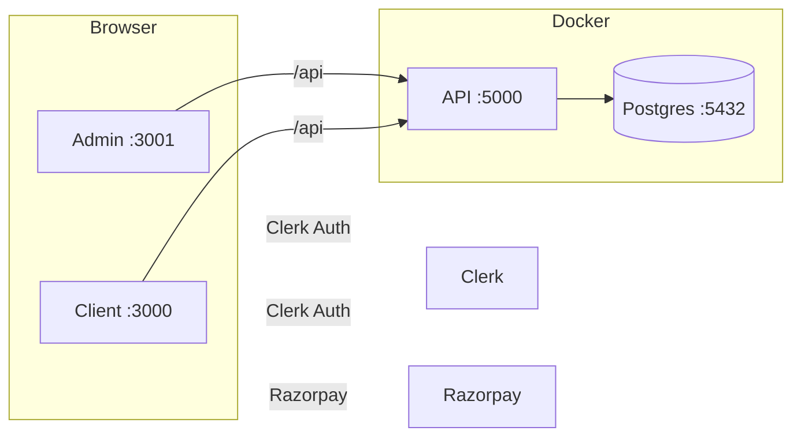

# 👗 Fashion Place

[](https://reactjs.org)
[](https://vitejs.dev)
[](https://expressjs.com)
[](https://prisma.io)
[](https://postgresql.org)
[](https://clerk.com)
[](https://razorpay.com)
[](https://docker.com)

Full-stack e-commerce platform for fashion products — customer storefront, admin dashboard, and REST API.

---

## Features

### 🛍️ Customer Storefront (`client/`)
- Product catalogue with category filtering
- Product detail page with image gallery
- Shopping cart (add, update quantity, remove)
- Checkout with **Razorpay** payment integration
- Order history and order tracking
- User account management
- Clerk authentication (email, Google, GitHub, magic links)
- Dark mode

### 📊 Admin Dashboard (`admin/`)
- Overview stats (revenue, orders, products, users)
- Product management (CRUD with image upload)
- Category management (CRUD)
- Order management (view, update status)
- User management (view list)
- Clerk authentication (admin-gated)
- Dark mode

### ⚙️ API (`api/`)
- RESTful endpoints for products, categories, cart, orders, users
- Clerk JWT verification middleware
- Zod request validation
- Prisma ORM with PostgreSQL
- Helmet, CORS, rate limiting

### 🌐 Monorepo
- **npm workspaces** — single `npm install` at root
- **Docker Compose** — one-command startup (PostgreSQL + API + 2 frontends)

---

## Architecture



---

## Tech Stack

| Layer | Technology |
|---|---|
| **Client** | React 17, Vite 2, WindiCSS, React Router 6 |
| **Admin** | React 17, Vite 2, Bootstrap 5, React-Bootstrap |
| **API** | Node.js, Express 4, Prisma 7, Zod 4 |
| **Database** | PostgreSQL 16 |
| **Auth** | Clerk (JWT verification on API) |
| **Payments** | Razorpay |
| **Infra** | Docker, Docker Compose |

---

## Quick Start (Docker)

```bash
# 1. Clone
git clone https://github.com/your-username/Fashion-Place && cd Fashion-Place

# 2. Copy environment variables
cp .env.example .env
# then edit .env with your Clerk & Razorpay keys

# 3. Start everything
docker compose up --build
```

| Service | URL |
|---|---|
| Client | http://localhost:3000 |
| Admin | http://localhost:3001 |
| API | http://localhost:5000 |
| PostgreSQL | `localhost:5432` |

---

## Manual Setup

### Prerequisites
- Node.js 18+
- PostgreSQL 16 (running)
- npm 8+

### 1. Install dependencies

```bash
npm install
```

### 2. Configure environment

```bash
cp api/.env.example api/.env
cp client/.env.example client/.env
```

Create `admin/.env`:

```
VITE_API_URL=http://localhost:5000
VITE_CLERK_PUBLISHABLE_KEY=pk_test_xxxx
```

### 3. Set up the database

```bash
# Push Prisma schema to PostgreSQL
cd api
npx prisma db push

# Seed sample data
npm run seed
```

### 4. Start development

```bash
# All services
npm run dev         # API :5000 + Client :3000

# Individual services
npm run api         # API only
npm run client      # Client only
npm run admin       # Admin only
```

---

## Environment Variables

### API (`api/.env`)

| Variable | Required | Default | Description |
|---|---|---|---|
| `DATABASE_URL` | Yes | — | PostgreSQL connection string |
| `CLERK_SECRET_KEY` | Yes | — | Clerk API secret key |
| `RAZORPAY_KEY_ID` | Yes | — | Razorpay key ID |
| `RAZORPAY_KEY_SECRET` | Yes | — | Razorpay key secret |
| `PORT` | No | `5000` | API server port |

### Client (`client/.env`)

| Variable | Required | Description |
|---|---|---|
| `VITE_API_URL` | Yes | API base URL |
| `VITE_RAZORPAY_KEY_ID` | Yes | Razorpay publishable key |
| `VITE_CLERK_PUBLISHABLE_KEY` | Yes | Clerk publishable key |

### Admin (`admin/.env`)

| Variable | Required | Description |
|---|---|---|
| `VITE_API_URL` | Yes | API base URL |
| `VITE_CLERK_PUBLISHABLE_KEY` | Yes | Clerk publishable key |

---

## Project Structure

```
Fashion-Place/
├── api/                          # Express REST API
│   ├── config/                   # App configuration
│   ├── constants/                # Shared constants
│   ├── controllers/              # Route handlers (7 controllers)
│   ├── lib/                      # Prisma client singleton
│   ├── middleware/                # Auth, validation, error handling
│   ├── prisma/                   # Schema, migrations, seed
│   ├── repositories/             # Data access layer
│   ├── routes/                   # Express route definitions
│   ├── utils/                    # Helpers (response, errors, logger)
│   ├── validators/               # Zod schemas
│   ├── Dockerfile
│   └── index.js
│
├── client/                       # Customer storefront (SPA)
│   ├── src/
│   │   ├── components/           # UI components by domain
│   │   ├── pages/                # Route pages (10 pages)
│   │   ├── context/              # Cart, Theme, User providers
│   │   ├── hooks/                # Custom React hooks
│   │   ├── services/             # API client (Axios)
│   │   └── ...
│   ├── Dockerfile
│   └── nginx.conf
│
├── admin/                        # Admin dashboard (SPA)
│   ├── src/
│   │   ├── components/           # Common + layout components
│   │   ├── pages/                # Route pages (6 pages)
│   │   └── ...
│   ├── Dockerfile
│   └── nginx.conf
│
├── docker-compose.yml            # PostgreSQL + 3 services
├── .env.example                  # Docker environment template
└── package.json                  # npm workspaces root
```

---

## API Endpoints

### Authentication (Clerk)
| Method | Endpoint | Description |
|---|---|---|
| — | — | Clerk handles auth externally; API verifies Clerk JWTs |

### Products
| Method | Endpoint | Auth | Description |
|---|---|---|---|
| GET | `/products` | — | List products (query: `category`, `new`, `search`) |
| GET | `/products/:id` | — | Product details |
| POST | `/products` | Admin | Create product |
| PUT | `/products/:id` | Admin | Update product |
| DELETE | `/products/:id` | Admin | Delete product |

### Categories
| Method | Endpoint | Auth | Description |
|---|---|---|---|
| GET | `/categories` | — | List categories |
| POST | `/categories` | Admin | Create category |
| PUT | `/categories/:id` | Admin | Update category |
| DELETE | `/categories/:id` | Admin | Delete category |

### Cart
| Method | Endpoint | Auth | Description |
|---|---|---|---|
| GET | `/carts/:id` | User | Get cart |
| POST | `/carts` | User | Create cart |
| PUT | `/carts/:id` | User | Add items |
| PATCH | `/carts/:id` | User | Update quantity |
| DELETE | `/carts/:id` | User | Delete cart |
| POST | `/carts/clear` | User | Clear cart |

### Orders
| Method | Endpoint | Auth | Description |
|---|---|---|---|
| GET | `/orders` | Admin | All orders |
| GET | `/orders/stats` | Admin | Monthly sales stats |
| GET | `/orders/user/:id` | User | User's orders |
| GET | `/orders/:id` | User | Order details |
| POST | `/orders` | User | Create order |
| PUT | `/orders/:id` | Admin | Update status |
| DELETE | `/orders/:id` | Admin | Delete order |

### Users
| Method | Endpoint | Auth | Description |
|---|---|---|---|
| GET | `/users/me` | User | Current profile |
| GET | `/users` | Admin | All users |
| GET | `/users/stats` | Admin | Registration stats |
| PUT | `/users/:id` | User | Update profile |
| DELETE | `/users/:id` | User | Delete account |

### Checkout
| Method | Endpoint | Auth | Description |
|---|---|---|---|
| POST | `/checkout/verify` | User | Verify Razorpay payment |

---

## Database Schema (Prisma)

| Model | Key Fields | Relationships |
|---|---|---|
| **User** | id, fullname, email, isAdmin | 1→Cart, 1→* Order |
| **Category** | id, name | *→* Product (via ProductCategory) |
| **Product** | id, title, price, inStock, sizes[], colors[] | *→* Category, 1→* CartItem, 1→* OrderItem |
| **ProductImage** | id, url | *→1 Product |
| **Cart** | id, userId | 1→1 User, 1→* CartItem |
| **CartItem** | quantity | *→1 Product, *→1 Cart |
| **Order** | id, amount, status, address (JSON) | *→1 User, 1→* OrderItem |
| **OrderItem** | quantity | *→1 Product, *→1 Order |

---

## License

MIT
